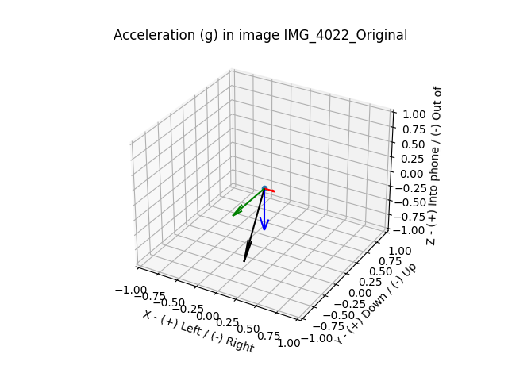

# About

Pictures taken on an iPhone have a proprietary section in the image metadata that among other things, can include accelerometer data and focus area information.

https://exiftool.org/TagNames/Apple.html

https://www.awaresystems.be/imaging/tiff/tifftags/privateifd/exif/subjectarea.html


This tool consist of a simple Python script that can:

1. Create a plot of the accelerometer information

Example:



2. Highlight the focus subject area

Example (see red rectangle)


# Setup

## Python

* [matplotlib](https://matplotlib.org/) for drawing images
* [pandas](https://pandas.pydata.org/) for easy CSV file conversion

## Linux

* [exiftool](https://exiftool.org/) for extracting EXIF data
* [imageMagick](https://www.imagemagick.org/) for drawing atop the image

# Usage

```
usage: ios_advanced_exif_analyzer.py [-h] [-i INPUT_FILE]

options:
  -h, --help            show this help message and exit
  -i INPUT_FILE, --input-file INPUT_FILE
                        iPhone image filename
```